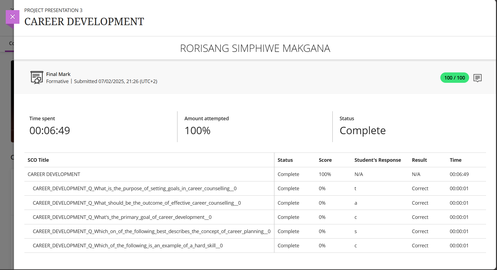
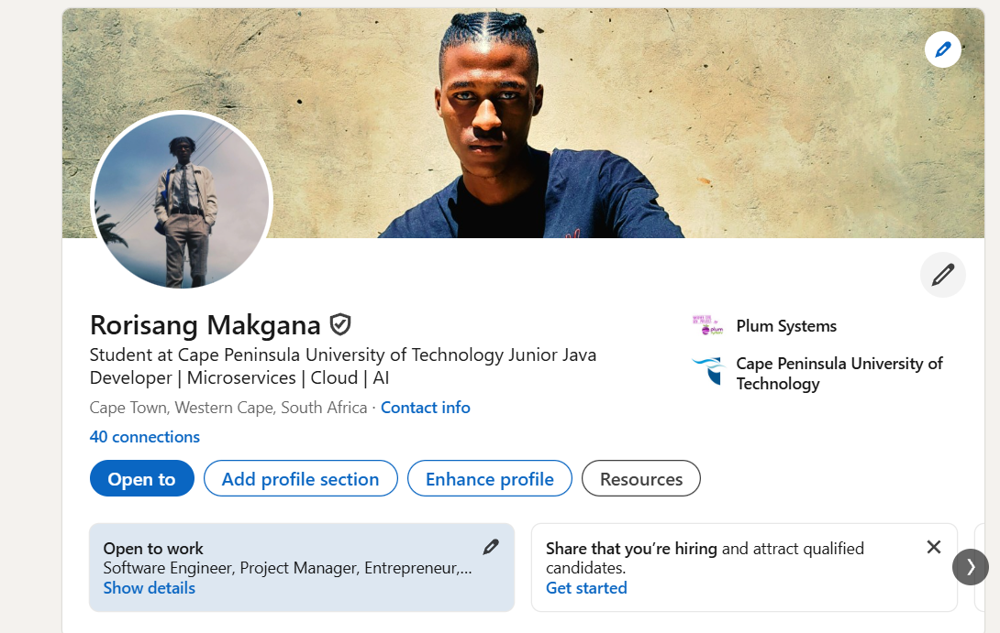

# PRP3-professional_practice--Career_Councelling

## 📌 1. Career Counselling

### 📂 Evidence
- 

### 💭 Reflection (STAR)
**S**ituation:
> As part of a career development workshop, we were introduced to various members of the councelling department on the CPUT campus, where they gave talks on how we can go about upskilling ourselves and reviewing our professional portfolios. I completed a professional assessment to understand my potential paths.
**T**ask:
> After having partook in the career workshop, I'd aimed to clarify my career direction by identifying more software developer roles that align with my personality and values, and also taking into consideration varios tasks such as understanding where my professional and techical expertise lies in order to tailor my image to my strengths.  
**A**ction:
> We had all had the opportunity to engage with a career advisor from the Councelling department, and after getting feedback I'd used LinkedIn Learning's tools to assess my interests and go forward with applying these to my digital portfolio
>   
**R**esult:
> I realized my strengths are best suited for [e.g., front-end development, backend development], and I’m now tailoring my projects and CV accordingly.

---
